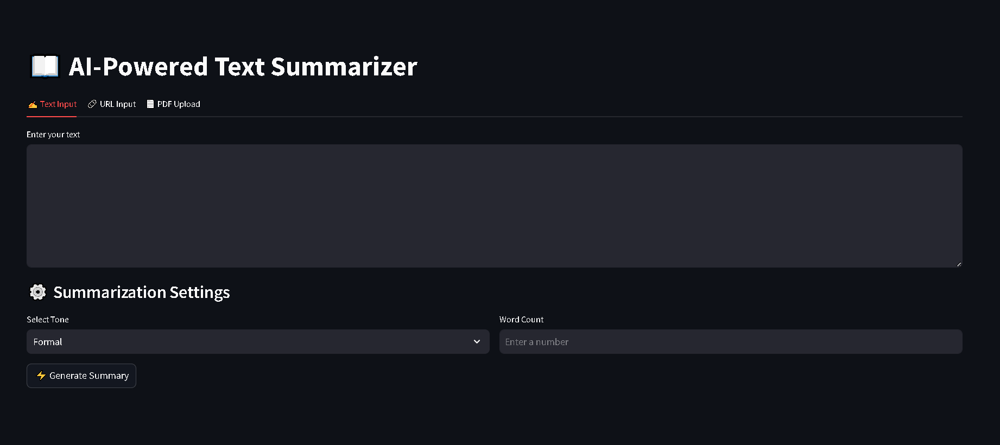

# AI-Powered Text Summarizer



## Overview
The AI-Powered Text Summarizer is a Streamlit-based web application that allows users to generate concise summaries of text, URLs, or PDFs using Google's Gemini AI model. The summarization can be customized based on tone and word count preferences.

## Features
- **Multiple Input Options:** Users can input text manually, provide a URL, or upload a PDF file.
- **AI-Powered Summarization:** Uses Google's `gemini-1.5-flash-8b` model to generate summaries.
- **Customizable Settings:** Users can select the tone of the summary and specify a word count.
- **Download Options:** Generated summaries can be downloaded as TXT or DOCX files.
- **User-Friendly Interface:** Built with Streamlit for an interactive and responsive experience.

## Installation
### Prerequisites
- Python 3.8+
- A Google API Key for accessing Gemini AI

### Setup
1. Clone the repository:
   ```bash
   git clone https://github.com/PriyanshuDey23/SummarizeAI.git
   cd text-summarizer
   ```
2. Create a virtual environment:
   ```bash
   python -m venv venv
   source venv/bin/activate  # On Windows use `venv\Scripts\activate`
   ```
3. Install dependencies:
   ```bash
   pip install -r requirements.txt
   ```
4. Set up environment variables:
   - Create a `.env` file in the root directory and add:
     ```
     GOOGLE_API_KEY=your_google_api_key
     ```

## Usage
1. Run the Streamlit app:
   ```bash
   streamlit run app.py
   ```
2. Open the web interface and choose your preferred input method (Text, URL, or PDF).
3. Select the tone and word count for summarization.
4. Click **Generate Summary** to obtain the AI-generated summary.
5. Download the summary in TXT or DOCX format as needed.

## File Structure
```
text-summarizer/
│-- app.py          # Main Streamlit application
│-- prompt.py       # Prompt template for AI summarization
│-- utils.py        # Helper functions for text extraction & file conversion
│-- requirements.txt # Required dependencies
│-- .env            # API key configuration
│-- README.md       # Documentation
```

## Dependencies
The application relies on the following Python packages:
- `streamlit`
- `langchain`
- `langchain_google_genai`
- `python-dotenv`

## Contributing
1. Fork the repository.
2. Create a new branch (`feature-branch`).
3. Make your changes and commit them.
4. Push to your fork and submit a pull request.

## License
This project is licensed under the MIT License.

